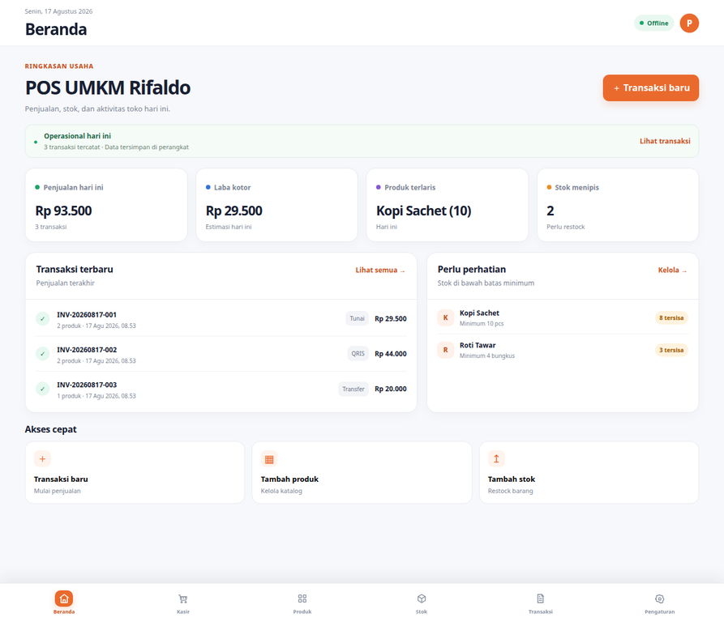
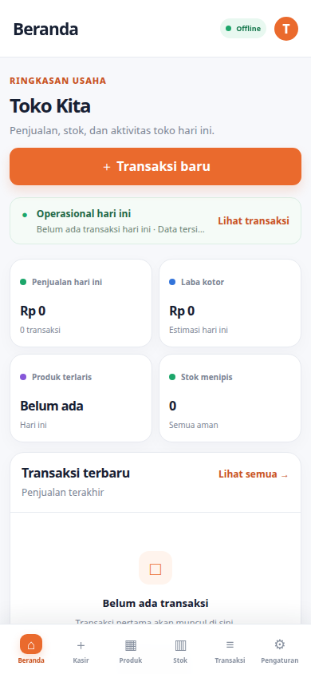
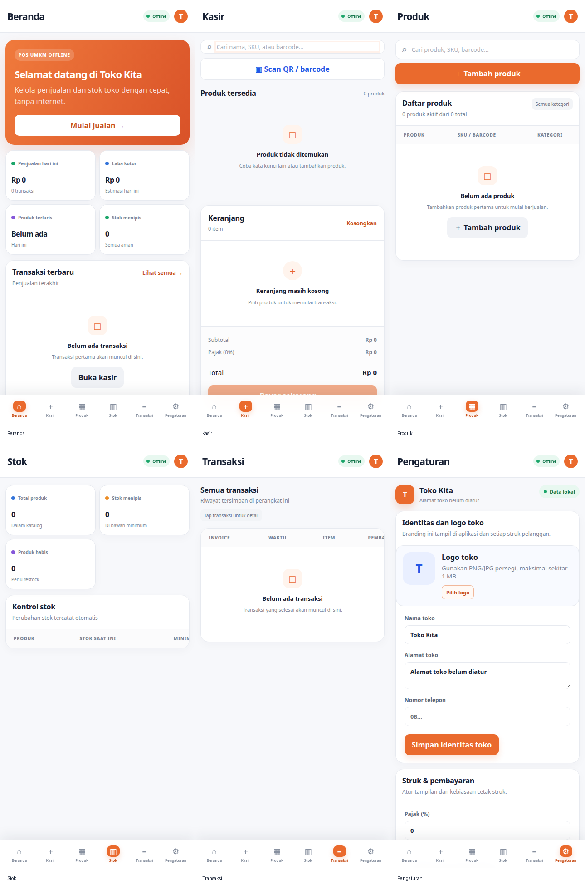
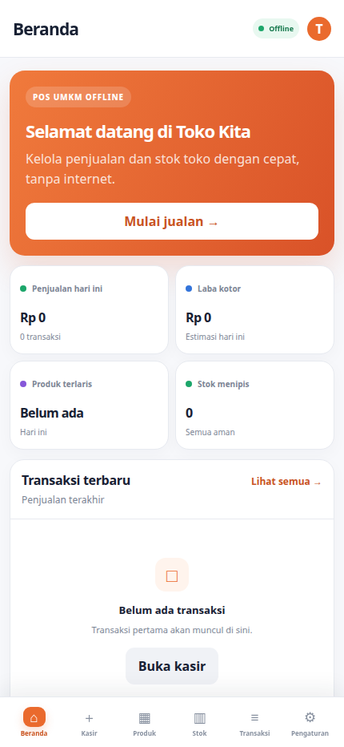
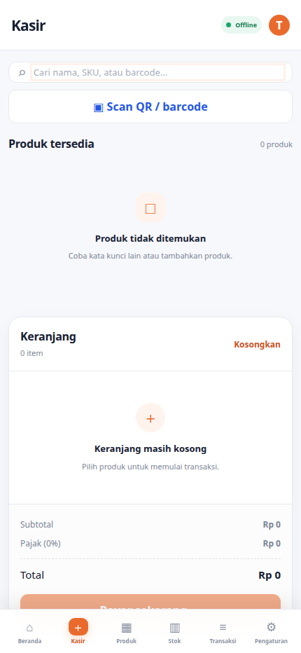
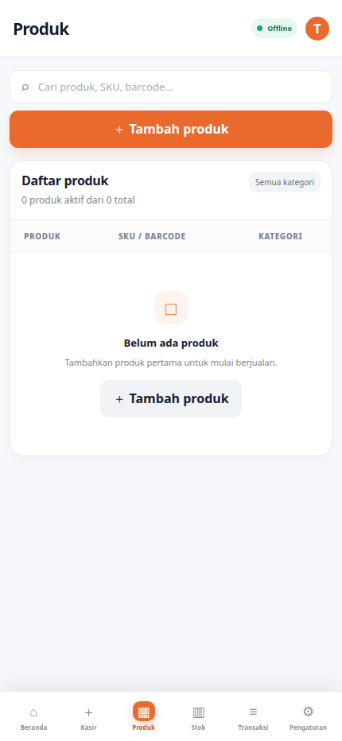
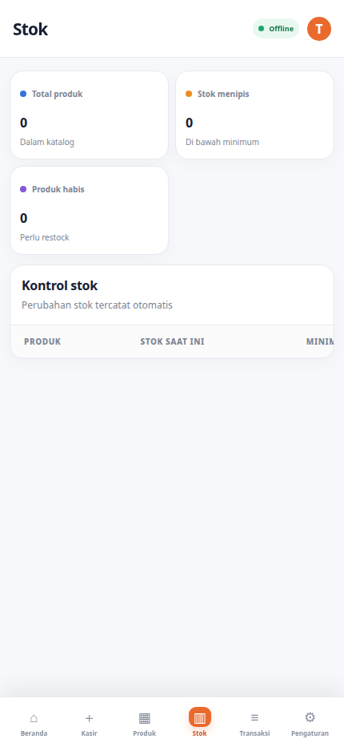
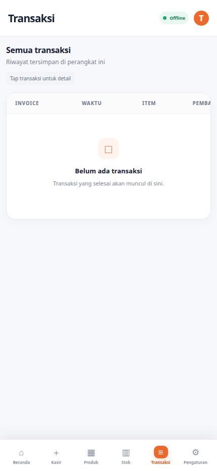
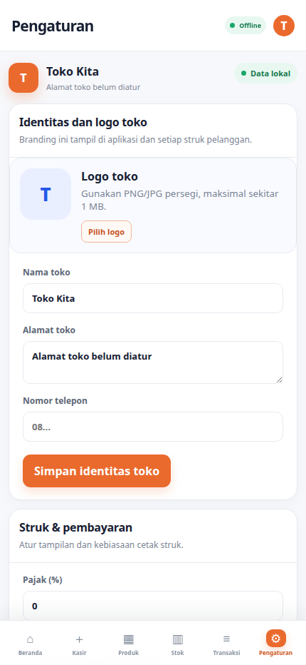

# POS UMKM Rifaldo

POS UMKM Rifaldo adalah aplikasi **Point of Sale offline-first** untuk warung, toko kecil, kios, dan usaha rumahan. Aplikasi berjalan sebagai client-only Android app menggunakan React, TypeScript, Vite, CapacitorJS, dan SQLite lokal. Tidak diperlukan server pusat untuk mencatat transaksi, mengelola produk, mengatur stok, atau menyiapkan backup.

> **Package Android:** `pos.rifaldo`  
> **Release publik:** [POS UMKM Rifaldo v1.0.0](https://github.com/Rifaldo-dev/pos-capacitorjs/releases/tag/v1.0.0)

## Tampilan aplikasi

### Dashboard desktop

Dashboard menampilkan status offline, identitas toko, penjualan hari ini, laba kotor, produk terlaris, stok menipis, transaksi terbaru, dan aksi cepat. Navigasi utama tetap berada di bagian bawah.



### Tampilan mobile

Layout mobile dirancang untuk penggunaan kasir sehari-hari. Bottom navigation menyediakan akses cepat ke **Beranda, Kasir, Produk, Stok, Transaksi, dan Pengaturan**.



## Galeri semua menu

Berikut adalah tampilan seluruh menu utama yang tersedia pada bottom navigation POS UMKM Rifaldo. Galeri ini menunjukkan keadaan awal aplikasi dengan data kosong agar setiap UMKM dapat melihat struktur layar sebelum mengatur toko dan memasukkan katalog mereka.



### Beranda

Ringkasan operasional toko: status offline, identitas toko, penjualan hari ini, laba kotor, produk terlaris, stok menipis, transaksi terbaru, dan aksi cepat.



### Kasir

Layar transaksi dengan pencarian nama/SKU/barcode, tombol **Scan QR / barcode**, daftar produk, keranjang, ringkasan pajak, total, dan tombol pembayaran.



### Produk

Katalog produk dengan pencarian, SKU/barcode, kategori, harga jual, stok, dan aksi tambah produk. Barcode dapat diisi dari kamera melalui form produk.



### Stok

Kontrol persediaan yang menampilkan total produk, stok menipis, produk habis, status minimum, dan aksi restock.



### Transaksi

Riwayat transaksi dengan invoice, waktu, jumlah item, metode pembayaran, total, status, dan akses ke detail struk.



### Pengaturan

Pengaturan publik untuk setiap UMKM: logo toko, nama toko, alamat, nomor telepon, pajak, footer struk, cetak otomatis, backup/restore, dan data demo.



## Fitur utama

| Area | Kemampuan |
|---|---|
| Dashboard | Ringkasan penjualan, laba kotor, produk terlaris, stok menipis, transaksi terbaru, dan aksi cepat. |
| Kasir | Pencarian produk berdasarkan nama, SKU, atau barcode; keranjang; diskon; pajak; pembayaran tunai/non-tunai; kembalian; dan invoice. |
| Scan kamera | Scan QR/barcode dari kamera Android untuk menemukan produk dan memasukkannya langsung ke keranjang. Form tambah produk juga dapat mengisi barcode dari kamera. |
| Produk | Katalog produk, kategori, harga beli/jual, stok, batas minimum, barcode/SKU, status aktif, dan stok negatif yang dapat diatur. |
| Stok | Pergerakan stok, restock manual, penyesuaian stok, dan informasi stok menipis. |
| Transaksi | Riwayat invoice, detail transaksi, void, pengembalian stok, cetak struk, dan bagikan struk. |
| Branding UMKM | Ubah nama toko, upload logo, alamat, nomor telepon, footer struk, pajak, serta pilihan cetak otomatis. |
| Data offline | SQLite lokal pada Android, localStorage fallback pada browser preview, backup/restore JSON berversi, dan seed data demo. |

## Setup toko untuk setiap UMKM

Setelah aplikasi diinstal, buka menu **Pengaturan**. Masukkan nama toko, alamat, nomor telepon, dan footer yang ingin ditampilkan pada struk. Upload logo toko dalam format PNG, JPG, atau WebP. Logo dan identitas tersebut akan digunakan pada header aplikasi, dialog struk, hasil cetak, dan data backup lokal.

Untuk menggunakan scanner, buka **Kasir** lalu tekan tombol **Scan QR / barcode**. Izinkan akses kamera Android ketika diminta. Jika kode cocok dengan SKU atau barcode produk, item akan langsung ditambahkan ke keranjang. Saat membuat produk baru, tombol scan pada form produk dapat digunakan untuk mengisi barcode tanpa mengetik manual.

Struk dapat dicetak melalui dialog print Android/browser atau dibagikan melalui Android Share. Jika sistem Share tidak tersedia, aplikasi menyediakan fallback berupa penyalinan teks struk.

## Menjalankan dari source code

### Prasyarat

Gunakan Node.js 22 LTS, JDK 21 untuk Capacitor 8, serta Android SDK API 36. Android Studio tidak wajib untuk build command-line karena repository menyediakan Gradle Wrapper. Untuk menjalankan preview web saja, Node.js sudah cukup.

### Web preview

```bash
git clone https://github.com/Rifaldo-dev/pos-capacitorjs.git
cd pos-capacitorjs
nvm use
npm install
npm run dev
```

Preview browser memakai localStorage sebagai fallback persistence. Kamera QR/barcode native digunakan pada APK Android; browser preview dapat digunakan untuk meninjau layout dan alur POS.

### Build Android

```bash
npm run build
npx cap sync android
cd android
export JAVA_HOME=/path/to/jdk-21
./gradlew -Dorg.gradle.java.installations.paths="$JAVA_HOME" assembleDebug
```

APK debug dihasilkan pada lokasi berikut:

```text
android/app/build/outputs/apk/debug/app-debug.apk
```

Atau unduh APK siap instal dari [GitHub Releases](https://github.com/Rifaldo-dev/pos-capacitorjs/releases/tag/v1.0.0).

## Arsitektur offline

Lapisan UI memakai state domain yang sama dengan adapter persistence. Pada Android, inisialisasi native menyiapkan SQLite melalui `@capacitor-community/sqlite`, termasuk tabel POS, foreign key, index, dan `schema_migrations`. Snapshot state disimpan agar UI dapat dipulihkan ketika aplikasi dibuka kembali. Browser preview menggunakan localStorage sebagai fallback supaya alur dapat diuji tanpa perangkat Android.

Struktur utama project adalah sebagai berikut:

```text
src/
├── App.tsx             # UI UMKM, bottom navigation, kasir, scanner, branding, struk
├── types.ts            # domain types dan store settings
├── pos.ts              # kalkulasi dan validasi domain
├── storage.ts          # SQLite initialization, migration, persistence, backup
├── pos.test.ts         # unit tests
└── styles.css          # mobile-first UI dan print stylesheet
android/                # project Capacitor Android dengan Gradle Wrapper
capacitor.config.ts     # appId: pos.rifaldo
docs/                   # catatan scanner dan screenshot UI
releases/               # APK dan checksum yang ikut dipush ke repository
```

## Database dan integritas transaksi

Native SQLite menyiapkan tabel `categories`, `products`, `customers`, `suppliers`, `transactions`, `transaction_items`, `stock_movements`, `expenses`, `settings`, `app_state`, dan `schema_migrations`. Foreign key, unique invoice/SKU constraints, serta index pencarian produk dan waktu transaksi disiapkan ketika database dibuka. Migration baru harus menaikkan `DB_VERSION` dan bersifat idempotent.

Nilai uang disimpan sebagai integer Rupiah. Item transaksi mempertahankan snapshot nama, harga, quantity, dan subtotal sehingga histori tidak berubah ketika katalog diedit. Penyelesaian transaksi memperbarui transaksi, item, produk, dan stock movement melalui state yang divalidasi sebelum disimpan.

## Format backup

Backup menggunakan JSON berversi agar data toko dapat dipindahkan atau disimpan secara manual.

```json
{
  "format": "POS Backup",
  "version": 1,
  "createdAt": "2026-08-15T00:00:00.000Z",
  "data": {
    "version": 1,
    "categories": [],
    "products": [],
    "customers": [],
    "transactions": [],
    "expenses": [],
    "stockMovements": [],
    "settings": {}
  }
}
```

Restore memvalidasi format dan versi, lalu meminta konfirmasi sebelum mengganti data aktif. Logo toko disimpan sebagai data URL di snapshot lokal dan ikut terbawa dalam backup JSON.

## Testing dan hasil verifikasi

```bash
npm test
npm run lint
npm run build
```

Suite saat ini mencakup perhitungan subtotal, diskon, pajak, total, kembalian yang aman, dan pencegahan penjualan ketika stok tidak mencukupi. Verifikasi terakhir menghasilkan **3 test lulus, lint 0 warning/0 error, web build berhasil, dan Android debug build berhasil**.

## GitHub Release

Rilis publik tersedia pada [v1.0.0](https://github.com/Rifaldo-dev/pos-capacitorjs/releases/tag/v1.0.0) dengan asset berikut:

| Asset | Keterangan |
|---|---|
| `pos-rifaldo-public-debug.apk` | APK debug siap instal pada Android. |
| `pos-rifaldo-public-debug.apk.sha256` | Checksum SHA-256 untuk verifikasi file APK. |

## Keterbatasan saat ini

Versi ini belum menyediakan integrasi langsung dengan printer Bluetooth thermal tertentu, modul supplier/customer/purchasing/expenses yang lengkap, laporan custom range, CSV import/export, PIN app lock, atau dark mode native. Fitur cetak menggunakan dialog print Android/browser dan Android Share. Integrasi printer thermal langsung memerlukan plugin printer yang sesuai serta pengujian pada model perangkat fisik yang digunakan oleh UMKM.
